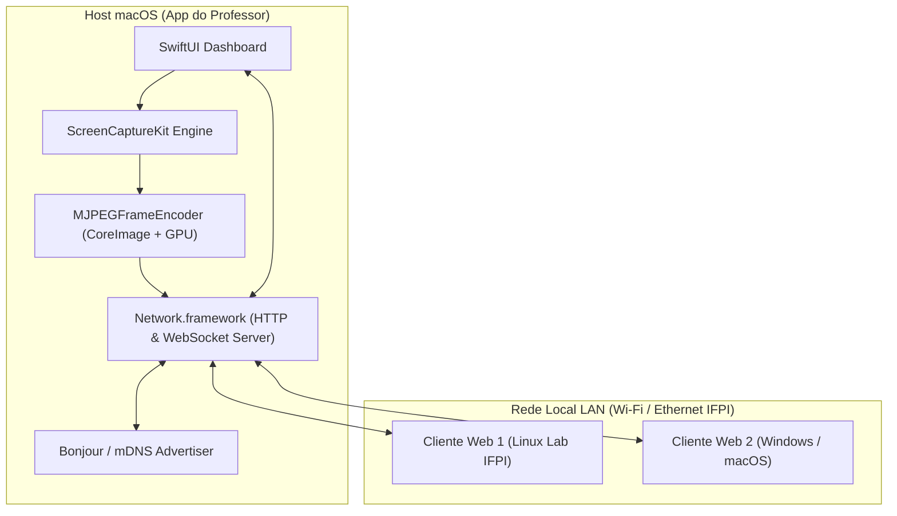
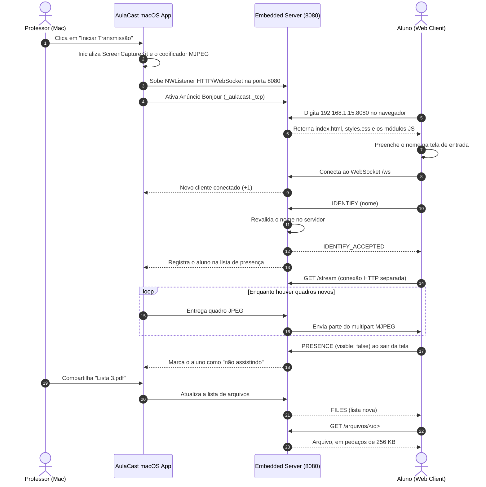

# Documento de Arquitetura & Design de Software
## Projeto: AulaCast - Transmissão de Tela em Rede Local (IFPI)

---

### 1. Visão Geral da Arquitetura de Software

O **AulaCast** segue uma arquitetura baseada em **Host Nativo (macOS)** e **Clientes Leves (Web)** conectados por uma rede de área local (LAN). O servidor embarcado utiliza a API moderna de redes da Apple (`Network.framework`) para servir conteúdo estático (HTML/CSS/JS) e gerenciar conexões bidirecionais persistentes via **WebSockets**.



---

### 2. Componentes Principais do App macOS (Swift)

#### 2.1. `CaptureEngine` (`ScreenCaptureKit`)
- **Responsabilidade:** Capturar o conteúdo dos monitores ou janelas selecionadas com alta taxa de quadros e baixo overhead de memória.
- **Implementação:** Utiliza `SCStream` e `SCStreamOutput`. Envia amostras de vídeo (`CMSampleBuffer`) para o codificador.

#### 2.2. `MJPEGFrameEncoder` (`CoreImage`)
- **Responsabilidade:** Converter `CMSampleBuffer` em quadros JPEG.
- **Decisões relevantes:**
  - O `CIContext` é criado **uma única vez** e reaproveitado. Recriá-lo por quadro compila shaders e aloca recursos de GPU repetidamente, inviabilizando o tempo real.
  - Quadros novos são **descartados enquanto o anterior ainda está sendo codificado**. Sem isso, uma codificação mais lenta que a captura enfileira quadros e o atraso cresce indefinidamente.
- **Saída:** `Data` com o JPEG pronto para envio.

#### 2.3. `HTTPServer` & `WebSocketServer` (`Network.framework`)
- **Responsabilidade:** Subir o ouvinte (`NWListener`) na porta 8080.
- **Rotas HTTP:**
  - `GET /`: Entrega o arquivo `index.html` (Player do Aluno).
  - `GET /styles.css` e `GET /js/*`: Recursos estáticos do cliente.
  - `GET /stream`: Fluxo de vídeo em `multipart/x-mixed-replace` (MJPEG), consumido por uma tag ``.
- **Rota WebSocket (`/ws`):** Gerencia conexões ativas e a troca de mensagens JSON (identificação, presença, chat e lista de arquivos).

> **O vídeo não trafega pelo WebSocket.** São duas conexões independentes: MJPEG sobre HTTP para a imagem e WebSocket para as mensagens. Por isso o cliente vigia as duas separadamente — uma pode cair enquanto a outra segue viva.

#### 2.4. `WebSocketFrameDecoder`
- **Responsabilidade:** Decodificar frames RFC 6455, isoladamente do gerenciamento de conexões.
- **Motivo de existir separado:** o TCP não respeita fronteira de mensagem. Uma leitura pode trazer dois frames colados ou metade de um, então o decodificador mantém um buffer próprio por conexão. Tratar cada leitura como exatamente um frame descartava mensagens em silêncio.

#### 2.5. `BonjourAdvertiser`
- **Responsabilidade:** Anunciar o serviço `_aulacast._tcp` usando `NWListener.service` no **próprio listener do servidor**, na porta fixa 8080. Antes o anúncio saía de um segundo listener, em porta sorteada a cada execução: quem achava a sala pelo Bonjour recebia uma porta que recusava conexão, e a porta mudava de aula para aula (ruim para liberar o app no firewall). Um nome repetido na rede é renomeado pelo sistema ("AulaCast - IFPI (2)") sem derrubar o servidor.

---

### 3. Protocolo de Comunicação WebSocket (JSON Schemas)

Toda a comunicação interativa utiliza o protocolo WebSocket na rota `/ws`. As mensagens trafegam em formato JSON estruturado com o campo `type`.

#### 3.1. Mensagem de Boas-Vindas (`CONNECTED`)
Enviada pelo servidor assim que o aluno conecta. Carrega o estado atual do chat e da
transmissão: sem isso, quem entra (ou reconecta) no meio da aula veria o campo de mensagem
liberado com o chat desligado, ou o último quadro congelado como se a aula estivesse ao vivo
quando ela está pausada ou encerrada. `stream` é `live`, `paused` ou `ended` (este com
`reason`). `pinned` só vem quando há mensagem fixada (seção 3.11).
```json
{
  "type": "CONNECTED",
  "payload": {
    "chatEnabled": true,
    "stream": "paused",
    "pinned": "Portal do Aluno: https://portal.exemplo.edu.br"
  }
}
```

#### 3.2. Identificação do Aluno (`IDENTIFY`)
Enviada pelo aluno na entrada. O servidor **revalida** o nome (de 2 a 40 caracteres) e
responde `IDENTIFY_ACCEPTED` ou `IDENTIFY_REJECTED` (com `payload.reason`). Só depois disso o
aluno aparece na lista do professor. O nome aceito fica guardado por conexão e é ele que
assina o chat.
```json
{
  "type": "IDENTIFY",
  "payload": {
    "name": "Ana Beatriz Sousa"
  }
}
```

#### 3.3. Presença na Tela (`PRESENCE`)
Enviada pelo aluno quando a aula deixa de estar (ou volta a estar) à vista.
```json
{
  "type": "PRESENCE",
  "payload": {
    "visible": false
  }
}
```

#### 3.4. Arquivos Compartilhados (`FILES` e `GET /arquivos/<id>`)
Enviada pelo servidor a todos quando o professor compartilha ou remove um arquivo; a mesma
lista vai em `payload.files` do `CONNECTED`. O download é uma requisição HTTP comum na porta
8080: o servidor só entrega arquivos da lista, pelo `id` sorteado, como
`application/octet-stream` com `Content-Disposition: attachment` (nome original em UTF-8,
RFC 6266/5987, e um nome só ASCII de reserva). O arquivo é lido do disco em pedaços de
256 KB, e o próximo só sai quando o anterior foi entregue — um arquivo grande não vai
inteiro para a memória. Id desconhecido, arquivo removido ou apagado do disco: 404.
```json
{
  "type": "FILES",
  "payload": {
    "files": [
      { "id": "5E0C…", "name": "Lista 3.pdf", "size": 184320 }
    ]
  }
}
```

#### 3.5. Envio de Mensagem de Chat (`CHAT_SEND`)
Mensagem de aluno vai ao professor e retorna **somente ao autor**. Já a mensagem do professor
é retransmitida a todos. O servidor é quem impõe essa separação — o cliente não decide. O
remetente é o nome aceito no `IDENTIFY` (um `sender` na mensagem é ignorado), e o texto é
cortado em 1000 caracteres. A resposta chega como `CHAT_MESSAGE` (`sender`, `text`, `isProf`).
```json
{
  "type": "CHAT_SEND",
  "payload": {
    "text": "Professor, como compilar o código pelo Terminal?"
  }
}
```

#### 3.6. Estado do Chat (`CHAT_STATE`)
Enviada a todos os alunos quando o professor liga ou desliga o chat nas configurações. O
servidor já descartava as mensagens com o chat desligado, mas em silêncio: o aluno escrevia,
enviava e o texto sumia sem explicação. Agora o campo e o botão ficam inativos na hora, sem
anunciar à turma que o professor desligou o chat. O descarte no servidor continua valendo — um
cliente adulterado que reative o campo segue sem alcançar o professor.
```json
{
  "type": "CHAT_STATE",
  "payload": {
    "enabled": "false"
  }
}
```

#### 3.7. Estado da Transmissão
Mensagens de controle enviadas pelo servidor: `STREAM_STARTED` quando a transmissão começa
(ou recomeça depois de uma queda), `STREAM_PAUSED` e `STREAM_RESUMED` quando o professor
congela ou retoma a imagem, e `STREAM_ENDED` quando a captura termina. O último estado
anunciado é repetido no `CONNECTED` de quem chega depois.
```json
{
  "type": "STREAM_ENDED",
  "payload": {
    "reason": "O monitor utilizado foi desconectado."
  }
}
```

#### 3.8. Batimento (`PING` / `PONG`)
O cliente manda `{"type":"PING"}` a cada 10 s e o servidor responde `{"type":"PONG"}`. Sem
nenhuma mensagem do servidor por 25 s, o cliente dá a conexão por morta e reconecta; sem
nenhum frame do cliente por 30 s, o servidor a encerra e tira o aluno da lista. É o que pega
o notebook que dormiu ou saiu do Wi-Fi sem fechar a conexão.

#### 3.9. Regras do protocolo impostas pelo servidor
Frames do navegador precisam vir mascarados. Frames de controle têm até 125 bytes e não são
fragmentados. Opcodes reservados e bits RSV encerram a conexão. Um `CLOSE` recebido é
devolvido antes de fechar.

#### 3.10. Mão levantada (`RAISE_HAND`, `RAISE_HAND_ACK`, `HAND_LOWERED`)
O aluno levanta ou abaixa a mão com `{"type":"RAISE_HAND","payload":{"active":true}}`, e o
servidor confirma com `RAISE_HAND_ACK` (mesmo `active`). Só vale depois do `IDENTIFY`
aceito, e o nome é sempre o do `IDENTIFY`, nunca um campo do payload: de outra forma um aluno
levantaria a mão em nome de um colega. Quando o professor abaixa a mão de alguém, só aquele
aluno recebe `{"type":"HAND_LOWERED"}`. A mão é estado da conexão: ao reconectar, o cliente
reenvia `RAISE_HAND` logo depois do `IDENTIFY`; ao sair, a mão sai com ele.

#### 3.11. Mensagem fixada (`CHAT_PINNED`)
O professor fixa uma mensagem sua (um link do Portal do Aluno, o prazo de uma lista) e ela
fica no topo do chat de toda a turma. Uma por vez: fixar outra substitui. O texto vai
serializado por `JSONSerialization` (aspas e quebras de linha chegam intactas); `null`
desafixa. Quem entra depois recebe a fixada no `CONNECTED`.
```json
{ "type": "CHAT_PINNED", "payload": { "text": "Lista 4: https://portal.exemplo.edu.br/l4" } }
{ "type": "CHAT_PINNED", "payload": { "text": null } }
```

---

### 4. Diagrama de Sequência: Fluxo de Transmissão & Interação



---

### 4.1. Desempenho: o que foi medido e comparado com as práticas consolidadas

Medições feitas num MacBook Air (Apple Silicon), monitor 1470x956 pontos (Retina), 30 fps.

| Ponto | Prática de referência | Antes | Agora |
| :--- | :--- | :--- | :--- |
| Codificação JPEG | Trabalho mínimo por quadro na fila da captura (guia do ScreenCaptureKit) | `CIContext` → `CGImage` → `NSBitmapImageRep`: 6,0 ms de CPU por quadro 1080p | `CIContext.jpegRepresentation` direto do pixel buffer: 1,0 ms, mesmo tamanho de arquivo |
| CPU do app transmitindo | — | ~31% de um núcleo (monitor), ~27% (janela) | ~16% (monitor), ~14% (janela) |
| Tamanho da captura | Saída na proporção da fonte (exemplo "Capturing screen content in macOS" da Apple) | 16:9 fixo: faixas pretas no monitor 16:10; janela encostada no canto | Proporção da fonte, limitada a 1920x1080 ou 1280x720, sem ampliar |
| Último quadro no Safari | Repetir o último quadro quando a imagem para (como fazem servidores MJPEG como o µStreamer) | O WebKit só desenha uma parte quando a próxima chega (bug 36536): a turma via o quadro anterior, e quem entrava com a tela parada não via nada | O último quadro é repetido uma vez, 150 ms depois de a imagem parar |
| Delimitador multipart | RFC 2046: o separador é `--` + boundary | Cabeçalho declarava `boundary=--frame` e o corpo usava `--frame` | `boundary=frame` |
| Quadros `.idle` / `.suspended` | Descartar o que não é `.complete` (exemplo da Apple) | Já chegam sem imagem e morrem no codificador, sem custo | Igual |
| Janela transmitida sumiu | Consulta periódica (o exemplo da Apple consulta o conteúdo a cada 3 s) | — | `CGWindowListCopyWindowInfo` de uma janela a cada 0,7 s: 77 µs por consulta, 0,011% de um núcleo. O status `.suspended` do ScreenCaptureKit também avisa, mas não veio em todos os fechamentos medidos, então não serve sozinho |

Protocolo: MJPEG sobre HTTP continua sendo a escolha certa para o requisito de zero
instalação e rede local. WebRTC (usado pelo Deskreen) exige negociação e UDP; H.264 sobre
WebSocket com WebCodecs acumula atraso quando a rede congestiona, porque o TCP entrega tudo
em ordem — foi o motivo de a Helix.ml voltar a JPEG sequencial. O AulaCast já faz o que eles
fizeram: cada aluno só recebe o próximo quadro quando o anterior terminou de sair.

Fontes: exemplo "Capturing screen content in macOS" (Apple); WWDC22 10156 e 10155; README
do µStreamer (pikvm/ustreamer); bug 36536 do WebKit; bug 987135 do Firefox; "We Mass-Deployed
15-Year-Old Screen Sharing Technology" (blog da Helix.ml).

### 4.2. Tela do professor: Material 3 Expressive no desenho do Google Meet

A tela do professor segue o **Material 3 Expressive** (Google, 2025) e a organização do **Google Meet**:
um palco escuro com a prévia, uma barra de controles embaixo e um painel lateral que mostra uma área por vez.
Continua mínima: cada informação tem um lugar só.

- **Barra inferior em três partes, como a do Meet:**
  - *Esquerda:* estado da aula num chip ("Ao vivo 12:04", "Pausada", "Interrompida", "Fora do ar") e o endereço
    da turma com botão de copiar. O endereço nunca é cortado. Se a janela estreita, o chip mostra só o ponto
    e o tempo.
  - *Centro:* os controles da aula (o que apresentar, pausar, qualidade) e a ação principal, "Iniciar
    transmissão" ou a pílula vermelha "Encerrar", no lugar do "Sair da chamada" do Meet.
  - *Direita:* os botões dos painéis (Alunos, Chat, Arquivos), com contadores. O botão do painel aberto
    fica preenchido e troca o círculo por um quadrado arredondado: é o *shape morph* do M3 Expressive.
- **Painel lateral, uma área por vez:** um cartão arredondado (28 pt) com título e botão de fechar. Clicar
  no botão do painel já aberto fecha o painel, como no Meet. O painel "Apresentar" (escolha de tela ou
  janela) também fica ali. O painel e a aba abertos são lembrados, e ⌥⌘I abre e fecha.
- **Não lidas:** as mensagens dos alunos que chegam com o chat fora de vista contam no botão do chat, num
  badge vermelho.
- **Chat:** no topo, o controle "Alunos podem escrever", onde o Meet põe o "Permitir que todos enviem
  mensagens". Antes ele ficava escondido no popover de qualidade. Abaixo vem o aviso de quem vê o quê. As
  mensagens aparecem sem balões (nome, hora e texto) e o campo de mensagem é uma pílula.
- **Alunos:** a lista segue o painel Pessoas do Meet. Cada aluno tem um avatar com as iniciais, numa cor
  fixa pelo nome, e uma linha "com a aula à vista" ou "em outra janela ou aba". No topo, um resumo diz
  quantos estão com a aula à vista.
- **Qualidade:** a resolução e os quadros por segundo são escolhidos em *connected button groups*, o
  substituto do segmented button no M3 Expressive.
- **Tokens:** o código tem os papéis de cor do M3 (surface containers tonais, primary, error e outros, com
  a paleta do Google para o modo claro e o escuro), a escala de tipos (display → label), os cantos 4/8/12/16/28, as
  molas de movimento (rígidas para efeitos, amortecidas para posição) e as camadas de estado (8% no hover,
  10% no clique). Tudo está em `views/Material/M3.swift`.
- **Fontes:** o texto usa a **Google Sans Flex** (SIL OFL 1.1) e os ícones usam os **Material Symbols
  Rounded** (Apache 2.0), as fontes do Material 3. As duas são variáveis: o ícone do painel aberto
  aparece preenchido pelo eixo FILL. Foram reduzidas ao alfabeto latino e aos cerca de 50 ícones usados:
  270 KB e 65 KB, com as licenças ao lado em `src/web-assets/fonts`, a mesma pasta que a página do aluno usa. O app as registra em tempo de execução
  (`CTFontManagerRegisterFontsForURL`) e, se não achar, volta para a fonte do sistema.
- **Por que não uma biblioteca:** o *Material Components for iOS* está em modo de manutenção desde 2021 e
  é UIKit/iOS. Não há biblioteca Material mantida para SwiftUI no macOS, então os tokens foram escritos
  à mão a partir da especificação.

Referências: [Material 3 Expressive](https://m3.material.io/blog/building-with-m3-expressive);
[cores](https://m3.material.io/styles/color/roles), [formas](https://m3.material.io/styles/shape/corner-radius-scale)
e [movimento](https://m3.material.io/styles/motion/overview/how-it-works) no m3.material.io;
[button groups](https://m3.material.io/components/button-groups/overview);
[Google Sans Flex](https://fonts.google.com/specimen/Google+Sans+Flex);
[Material Symbols](https://github.com/google/material-design-icons);
[Google Meet](https://workspace.google.com/products/meet/);
[Material Components iOS em manutenção](https://github.com/material-components/material-components-ios).

### 4.3. Tela do aluno: o mesmo desenho, do lado do navegador

A página do aluno foi refeita com os mesmos tokens do professor (cores claro/escuro, tipos,
formas, fontes), servidos pelo próprio app, sem internet. O que mudou, e por quê (feedback da
turma, triado de forma enxuta em `docs/feedback-tela-do-aluno.md`):

- **Palco + barra + painel, como no Meet:** a imagem num palco escuro; embaixo, o estado ("Ao
  vivo", "Pausada", "Reconectando…") e o nome com que o aluno entrou à esquerda, e os botões
  **Chat** e **Arquivos** à direita, cada um com seu contador. Uma área por vez no
  painel lateral, que o aluno fecha para ganhar tela.
- **Celular:** em pé, o painel sobe como folha por cima da imagem (tocar fora ou Esc fecha);
  deitado, a barra vira um trilho vertical à direita e a imagem ganha a altura inteira. Alvos
  de toque de 48 px e margens do entalhe do iPhone (`safe-area-inset`).
- **Tela cheia como a do YouTube:** vai para a tela cheia só a imagem (e os avisos de pausa e
  reconexão), sem barra nem painel. O botão fica na própria imagem, no canto de baixo à
  direita, como nos players: aparece quando o mouse passa por cima e some parado (na tela
  cheia, o cursor some junto); no celular fica sempre à vista. A tecla **F** e o duplo clique
  na imagem entram e saem. (Na primeira versão a tela cheia levava a página inteira, como no
  Meet, e a turma achou que a tela "nunca ficava cheia".) O Safari do iPhone não põe imagem em tela cheia;
  lá o caminho é "Adicionar à Tela de Início": o `manifest.webmanifest` (`display:
  fullscreen`) e as metas `apple-mobile-web-app-*` abrem a aula como app, sem a barra do
  navegador.
- **Mão levantada:** um ícone pequeno ao lado do campo de mensagem, que funciona mesmo com o
  chat desligado. O professor vê quem levantou primeiro no topo da lista e pode abaixar.
- **Links e mensagem fixada:** os links nas mensagens do professor viram clicáveis (só
  `http(s)://` e `www.`, montados com DOM, nunca `innerHTML`); a fixada fica no topo do chat.
  Com isso, "materiais e links da aula" não precisou de uma área nova: arquivos já têm o painel
  Arquivos, e links vão pelo chat.
- **Imagem que não pisca:** o vigia do vídeo só troca o `src` quando precisa (antes, cada
  reconexão reiniciava o vídeo duas vezes) e, ao trocar ou quando a conexão cai, pinta o
  último quadro num `<canvas>` por cima até chegar o quadro novo. Medido no Chrome 153 e no
  WebKit: nenhum quadro vazio na troca; antes, cerca de 1,85 s de área vazia. Com a conexão
  caída o aluno vê a imagem parada com um aviso pequeno, e não mais uma tela preta.
- **Tela que não apaga:** a Wake Lock API só existe em `https://`, e a aula é `http://`. O
  módulo `manter-tela-acesa.js` usa a API quando pode e, fora disso, a técnica do NoSleep.js
  (MIT): um vídeo minúsculo em laço, iniciado no gesto de "Entrar na aula". Medido com `pmset
  -g assertions`: Chrome e WebKit seguram a tela acordada. O vídeo **não pode ser mudo**
  (`muted` não segura a tela em nenhum dos dois), precisa estar no DOM (fora da tela, 1 px)
  e custa 3 a 4 pontos de CPU no Chrome. No celular, por ter trilha de áudio (silenciosa), pode
  pausar a música de outro app.

### 5. Estrutura de Arquivos e Módulos do Código Fonte

O projeto usa **Swift Package Manager** (sem `.xcodeproj`), com o núcleo isolado na biblioteca
`AulaCastCore` para que a suíte de testes possa exercitá-lo sem abrir a interface.

```text
AulaCast/
├── docs/
│   ├── 01-especificacao-requisitos.md
│   ├── 02-casos-de-uso.md
│   ├── 03-historias-de-usuario.md
│   └── 04-arquitetura-e-design.md
├── README.md
└── src/
    ├── Package.swift
    ├── sources/
    │   ├── aulacast-app/
    │   │   └── AulaCastApp.swift              # Executável AulaCast
    │   └── aulacast/                          # Biblioteca AulaCastCore
    │       ├── core/                          # Protocolos (DIP/ISP)
    │       │   ├── ScreenCaptureProtocol.swift
    │       │   ├── VideoEncoderProtocol.swift
    │       │   ├── NetworkServerProtocol.swift
    │       │   ├── FrameReceiverProtocol.swift
    │       │   └── EventObserverProtocols.swift
    │       ├── models/
    │       │   ├── ConnectedClient.swift      # Identificação e presença
    │       │   ├── ChatMessage.swift
    │       │   ├── DisplaySource.swift
    │       │   └── VideoResolution.swift
    │       ├── managers/
    │       │   ├── ClientManagerService.swift
    │       │   └── ChatManagerService.swift
    │       ├── services/
    │       │   ├── ScreenCaptureService.swift
    │       │   ├── ShareableContentFetcher.swift
    │       │   ├── ScreenRecordingPermissionService.swift
    │       │   ├── MJPEGFrameEncoder.swift
    │       │   ├── MJPEGStreamerService.swift
    │       │   ├── NetworkListenerService.swift
    │       │   ├── WebSocketHandlerService.swift
    │       │   ├── WebSocketFrameDecoder.swift
    │       │   ├── StaticFileProviderService.swift
    │       │   ├── BonjourAdvertiserService.swift
    │       │   └── WebAssetsPathResolver.swift
    │       ├── viewmodels/
    │       │   └── MainViewModel.swift
    │       └── views/
    │           ├── Material/M3.swift          # Tokens e componentes do Material 3
    │           ├── MainDashboardView.swift    # Palco + barra inferior (desenho do Meet)
    │           ├── ClassInspectorView.swift   # Painel lateral (uma área por vez)
    │           ├── SourcePickerView.swift
    │           ├── StudentListView.swift
    │           ├── ChatPanelView.swift
    │           ├── SharedFilesPanelView.swift
    │           ├── QualitySettingsView.swift
    │           └── AulaCastPalette.swift      # Cores da marca
    ├── tests/aulacast-tests/
    │   ├── TestRunnerMain.swift               # Suíte executável
    │   └── TestDoubles.swift                  # Dublês de captura, rede e codificação
    └── web-assets/                            # Cliente do aluno (sem framework)
        ├── index.html
        ├── styles.css                         # Tokens do Material 3 (claro e escuro)
        ├── manifest.webmanifest               # "Adicionar à Tela de Início" em tela cheia
        ├── apple-touch-icon.png
        ├── fonts/                             # Google Sans Flex e Material Symbols (+ licenças),
        │                                      #   usadas também pela tela do professor
        ├── js/
        │   ├── main.js
        │   ├── entry-gate.js                  # Tela de identificação
        │   ├── student-identity.js            # Nome do aluno na sessão
        │   ├── presence-reporter.js           # Presença na tela
        │   ├── socket-client.js               # WebSocket + reconexão
        │   ├── stream-watchdog.js             # Vigia o MJPEG; segura o último quadro
        │   ├── manter-tela-acesa.js           # Wake Lock ou vídeo em laço (NoSleep.js)
        │   ├── vendor/nosleep-media.js        # Vídeos do NoSleep.js (MIT)
        │   ├── chat-manager.js
        │   ├── links.js                       # Links clicáveis, montados com DOM
        │   ├── raise-hand.js                  # Mão levantada
        │   ├── files-list.js
        │   ├── ui-controller.js
        │   └── config.js
        └── tests/                             # Testes com node --test
```

---

### 6. Estratégia de Testes

Duas suítes, ambas **sem dependências externas** — coerente com o requisito de operação offline.

| Suíte | Como executar | Cobre |
| :--- | :--- | :--- |
| Swift | `swift run AulaCastTestRunner` | Domínio (turma, chat, identificação, presença), segurança (directory traversal), protocolo WebSocket (frames colados, partidos e malformados) e integração ponta a ponta com servidor e WebSocket reais |
| Cliente Web | `node --test "tests/*.test.js"` | Identificação do aluno, política de reconexão, watchdog do vídeo e relato de presença |

Os testes de integração sobem um `NetworkListenerService` real numa porta de teste e se
conectam como um aluno de verdade, em vez de simular as camadas — vários defeitos deste
projeto viviam justamente nas emendas entre camadas, invisíveis a testes isolados.