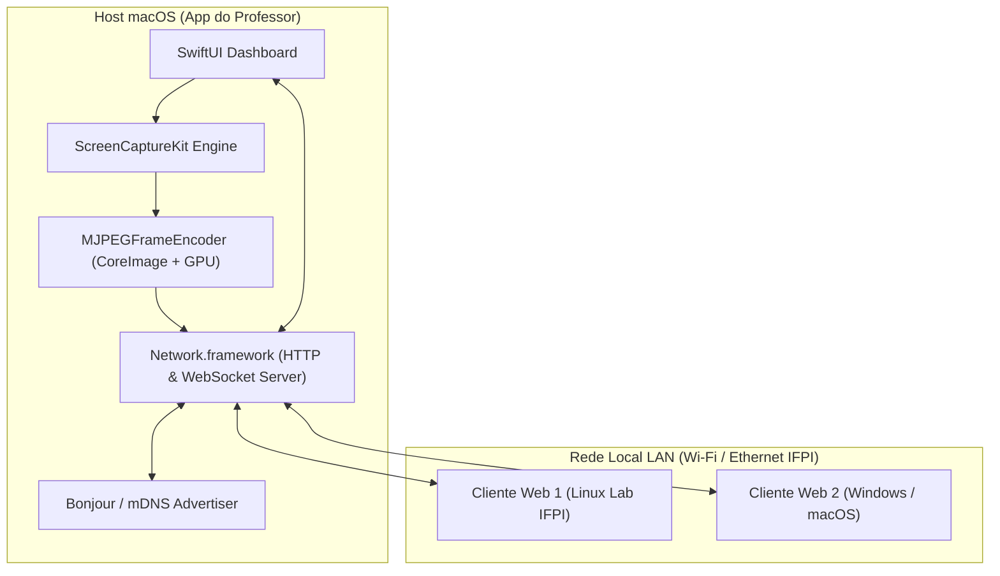
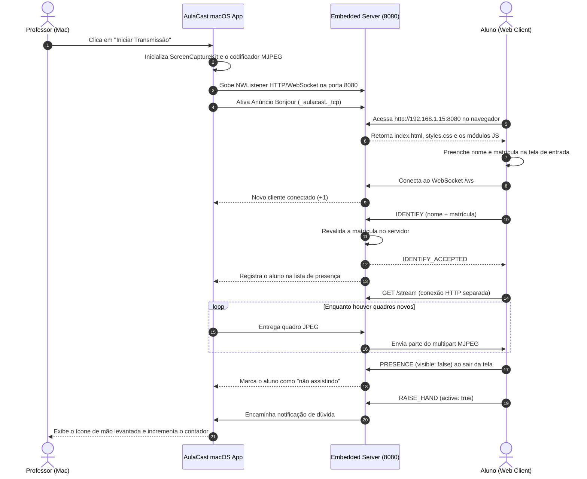

# Documento de Arquitetura & Design de Software
## Projeto: AulaCast - Transmissão de Tela em Rede Local (IFPI)

---

### 1. Visão Geral da Arquitetura de Software

O **AulaCast** segue uma arquitetura baseada em **Host Nativo (macOS)** e **Clientes Leves (Web)** conectados por uma rede de área local (LAN). O servidor embarcado utiliza a API moderna de redes da Apple (`Network.framework`) para servir conteúdo estático (HTML/CSS/JS) e gerenciar conexões bidirecionais persistentes via **WebSockets**.



---

### 2. Componentes Principais do App macOS (Swift)

#### 2.1. `CaptureEngine` (`ScreenCaptureKit`)
- **Responsabilidade:** Capturar o conteúdo dos monitores ou janelas selecionadas com alta taxa de quadros e baixo overhead de memória.
- **Implementação:** Utiliza `SCStream` e `SCStreamOutput`. Envia amostras de vídeo (`CMSampleBuffer`) para o codificador.

#### 2.2. `MJPEGFrameEncoder` (`CoreImage`)
- **Responsabilidade:** Converter `CMSampleBuffer` em quadros JPEG.
- **Decisões relevantes:**
  - O `CIContext` é criado **uma única vez** e reaproveitado. Recriá-lo por quadro compila shaders e aloca recursos de GPU repetidamente, inviabilizando o tempo real.
  - Quadros novos são **descartados enquanto o anterior ainda está sendo codificado**. Sem isso, uma codificação mais lenta que a captura enfileira quadros e o atraso cresce indefinidamente.
- **Saída:** `Data` com o JPEG pronto para envio.

#### 2.3. `HTTPServer` & `WebSocketServer` (`Network.framework`)
- **Responsabilidade:** Subir o ouvinte (`NWListener`) na porta 8080.
- **Rotas HTTP:**
  - `GET /`: Entrega o arquivo `index.html` (Player do Aluno).
  - `GET /styles.css` e `GET /js/*`: Recursos estáticos do cliente.
  - `GET /stream`: Fluxo de vídeo em `multipart/x-mixed-replace` (MJPEG), consumido por uma tag ``.
- **Rota WebSocket (`/ws`):** Gerencia conexões ativas e a troca de mensagens JSON (identificação, presença, chat e dúvidas).

> **O vídeo não trafega pelo WebSocket.** São duas conexões independentes: MJPEG sobre HTTP para a imagem e WebSocket para as mensagens. Por isso o cliente vigia as duas separadamente — uma pode cair enquanto a outra segue viva.

#### 2.4. `WebSocketFrameDecoder`
- **Responsabilidade:** Decodificar frames RFC 6455, isoladamente do gerenciamento de conexões.
- **Motivo de existir separado:** o TCP não respeita fronteira de mensagem. Uma leitura pode trazer dois frames colados ou metade de um, então o decodificador mantém um buffer próprio por conexão. Tratar cada leitura como exatamente um frame descartava mensagens em silêncio.

#### 2.5. `BonjourAdvertiser`
- **Responsabilidade:** Anunciar o serviço `_aulacast._tcp` na porta 8080 usando `NWListener.service`. Permite que aparelhos da rede identifiquem a sala sem precisar saber o IP exato do professor.

---

### 3. Protocolo de Comunicação WebSocket (JSON Schemas)

Toda a comunicação interativa utiliza o protocolo WebSocket na rota `/ws`. As mensagens trafegam em formato JSON estruturado com o campo `type`.

#### 3.1. Mensagem de Boas-Vindas (`CONNECTED`)
Enviada pelo servidor assim que o aluno conecta. Carrega o estado atual do chat: sem isso,
quem entra (ou reconecta) no meio da aula com o chat já desligado veria o campo de mensagem
liberado e só descobriria o bloqueio ao ver o próprio texto sumir.
```json
{
  "type": "CONNECTED",
  "payload": {
    "chatEnabled": true
  }
}
```

#### 3.2. Identificação do Aluno (`IDENTIFY`)
Enviada pelo aluno na entrada. O servidor **revalida** a matrícula e responde
`IDENTIFY_ACCEPTED` ou `IDENTIFY_REJECTED`.
```json
{
  "type": "IDENTIFY",
  "payload": {
    "name": "Ana Beatriz Sousa",
    "matricula": "2021234TADS5678"
  }
}
```

#### 3.3. Presença na Tela (`PRESENCE`)
Enviada pelo aluno quando a aula deixa de estar (ou volta a estar) à vista.
```json
{
  "type": "PRESENCE",
  "payload": {
    "visible": false
  }
}
```

#### 3.4. Notificação de "Levantar a Mão" (`RAISE_HAND`)
Enviada pelo aluno para pedir ajuda. O servidor identifica o aluno pela **conexão**, e não
pelo nome enviado, para que trocar de nome não crie um segundo registro na lista.
```json
{
  "type": "RAISE_HAND",
  "payload": {
    "studentName": "Ana Beatriz Sousa",
    "active": true
  }
}
```

#### 3.5. Envio de Mensagem de Chat (`CHAT_SEND`)
Mensagem de aluno vai ao professor e retorna **somente ao autor**. Já a mensagem do professor
é retransmitida a todos. O servidor é quem impõe essa separação — o cliente não decide.
```json
{
  "type": "CHAT_SEND",
  "payload": {
    "sender": "Mariana",
    "text": "Professor, como compilar o código pelo Terminal?"
  }
}
```

#### 3.6. Estado do Chat (`CHAT_STATE`)
Enviada a todos os alunos quando o professor liga ou desliga o chat nas configurações. O
servidor já descartava as mensagens com o chat desligado, mas em silêncio: o aluno escrevia,
enviava e o texto sumia sem explicação. Agora o campo e o botão ficam inativos na hora, sem
anunciar à turma que o professor desligou o chat. O descarte no servidor continua valendo — um
cliente adulterado que reative o campo segue sem alcançar o professor.
```json
{
  "type": "CHAT_STATE",
  "payload": {
    "enabled": "false"
  }
}
```

#### 3.7. Estado da Transmissão
Mensagens de controle enviadas pelo servidor: `STREAM_PAUSED` e `STREAM_RESUMED` quando o
professor congela ou retoma a imagem, e `STREAM_ENDED` quando a captura termina.
```json
{
  "type": "STREAM_ENDED",
  "payload": {
    "reason": "O monitor utilizado foi desconectado."
  }
}
```

---

### 4. Diagrama de Sequência: Fluxo de Transmissão & Interação



---

### 5. Estrutura de Arquivos e Módulos do Código Fonte

O projeto usa **Swift Package Manager** (sem `.xcodeproj`), com o núcleo isolado na biblioteca
`AulaCastCore` para que a suíte de testes possa exercitá-lo sem abrir a interface.

```text
AulaCast/
├── docs/
│   ├── 01-especificacao-requisitos.md
│   ├── 02-casos-de-uso.md
│   ├── 03-historias-de-usuario.md
│   └── 04-arquitetura-e-design.md
├── README.md
└── src/
    ├── Package.swift
    ├── sources/
    │   ├── aulacast-app/
    │   │   └── AulaCastApp.swift              # Executável AulaCast
    │   └── aulacast/                          # Biblioteca AulaCastCore
    │       ├── core/                          # Protocolos (DIP/ISP)
    │       │   ├── ScreenCaptureProtocol.swift
    │       │   ├── VideoEncoderProtocol.swift
    │       │   ├── NetworkServerProtocol.swift
    │       │   ├── FrameReceiverProtocol.swift
    │       │   └── EventObserverProtocols.swift
    │       ├── models/
    │       │   ├── ConnectedClient.swift      # Inclui matrícula e presença
    │       │   ├── ChatMessage.swift
    │       │   ├── DisplaySource.swift
    │       │   └── VideoResolution.swift
    │       ├── managers/
    │       │   ├── ClientManagerService.swift
    │       │   └── ChatManagerService.swift
    │       ├── services/
    │       │   ├── ScreenCaptureService.swift
    │       │   ├── ShareableContentFetcher.swift
    │       │   ├── ScreenRecordingPermissionService.swift
    │       │   ├── MJPEGFrameEncoder.swift
    │       │   ├── MJPEGStreamerService.swift
    │       │   ├── NetworkListenerService.swift
    │       │   ├── WebSocketHandlerService.swift
    │       │   ├── WebSocketFrameDecoder.swift
    │       │   ├── StaticFileProviderService.swift
    │       │   ├── BonjourAdvertiserService.swift
    │       │   └── WebAssetsPathResolver.swift
    │       ├── viewmodels/
    │       │   └── MainViewModel.swift
    │       └── views/
    │           ├── MainDashboardView.swift
    │           ├── SourcePickerView.swift
    │           ├── StudentListView.swift
    │           ├── ChatPanelView.swift
    │           ├── QualitySettingsView.swift
    │           └── AulaCastPalette.swift      # Tokens de cor e controles próprios
    ├── tests/aulacast-tests/
    │   ├── TestRunnerMain.swift               # Suíte executável
    │   └── TestDoubles.swift                  # Dublês de captura, rede e codificação
    └── web-assets/                            # Cliente do aluno (sem framework)
        ├── index.html
        ├── styles.css
        ├── apple-touch-icon.png
        ├── js/
        │   ├── main.js
        │   ├── entry-gate.js                  # Tela de identificação
        │   ├── student-identity.js            # Validação da matrícula
        │   ├── presence-reporter.js           # Presença na tela
        │   ├── socket-client.js               # WebSocket + reconexão
        │   ├── stream-watchdog.js             # Vigia o MJPEG
        │   ├── chat-manager.js
        │   ├── ui-controller.js
        │   └── config.js
        └── tests/                             # Testes com node --test
```

---

### 6. Estratégia de Testes

Duas suítes, ambas **sem dependências externas** — coerente com o requisito de operação offline.

| Suíte | Como executar | Cobre |
| :--- | :--- | :--- |
| Swift | `swift run AulaCastTestRunner` | Domínio (turma, chat, matrícula, presença), segurança (directory traversal), protocolo WebSocket (frames colados, partidos e malformados) e integração ponta a ponta com servidor e WebSocket reais |
| Cliente Web | `node --test "tests/*.test.js"` | Validação de matrícula, política de reconexão, watchdog do vídeo e relato de presença |

Os testes de integração sobem um `NetworkListenerService` real numa porta de teste e se
conectam como um aluno de verdade, em vez de simular as camadas — vários defeitos deste
projeto viviam justamente nas emendas entre camadas, invisíveis a testes isolados.