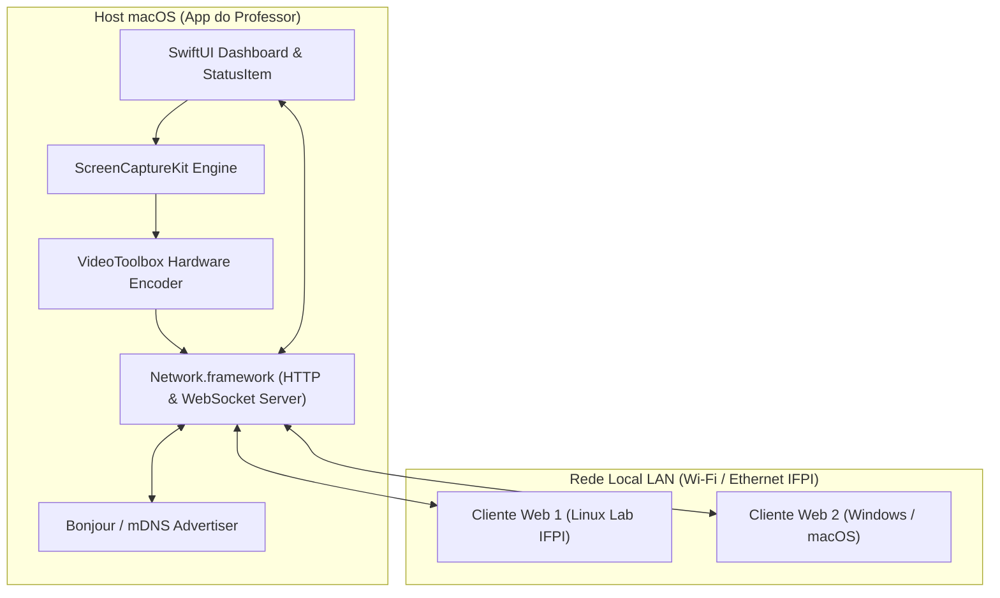
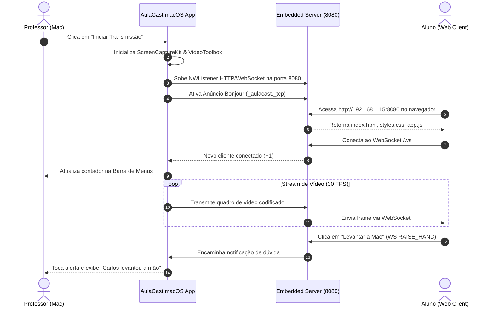

# Documento de Arquitetura & Design de Software
## Projeto: AulaCast - Transmissão de Tela em Rede Local (IFPI)

---

### 1. Visão Geral da Arquitetura de Software

O **AulaCast** segue uma arquitetura baseada em **Host Nativo (macOS)** e **Clientes Leves (Web)** conectados por uma rede de área local (LAN). O servidor embarcado utiliza a API moderna de redes da Apple (`Network.framework`) para servir conteúdo estático (HTML/CSS/JS) e gerenciar conexões bidirecionais persistentes via **WebSockets**.



---

### 2. Componentes Principais do App macOS (Swift)

#### 2.1. `CaptureEngine` (`ScreenCaptureKit`)
- **Responsabilidade:** Capturar o conteúdo dos monitores ou janelas selecionadas com alta taxa de quadros e baixo overhead de memória.
- **Implementação:** Utiliza `SCStream` e `SCStreamOutput`. Envia amostras de vídeo (`CMSampleBuffer`) para o codificador.

#### 2.2. `StreamEncoder` (`VideoToolbox`)
- **Responsabilidade:** Converter `CMSampleBuffer` em quadros compactados (H.264 ou JPEG de alta velocidade) acelerados por GPU.
- **Saída:** Buffers de bytes de vídeo codificados prontos para envio em rede.

#### 2.3. `HTTPServer` & `WebSocketServer` (`Network.framework`)
- **Responsabilidade:** Subir o ouvinte (`NWListener`) na porta 8080.
- **Rotas HTTP:**
  - `GET /`: Entrega o arquivo `index.html` (Player do Aluno).
  - `GET /styles.css`: CSS responsivo com tema escuro.
  - `GET /app.js`: Script do cliente WebSocket.
  - `GET /files/:filename`: Endpoint de download dos arquivos compartilhados.
- **Rota WebSocket (`/ws`):** Gerencia conexões ativas, retransmissão de vídeo em tempo real (broadcast) e troca de mensagens JSON (chat, dúvidas, arquivos).

#### 2.4. `BonjourAdvertiser`
- **Responsabilidade:** Anunciar o serviço `_aulacast._tcp` na porta 8080 usando `NWListener.service`. Permite que aparelhos da rede identifiquem a sala sem precisar saber o IP exato do professor.

---

### 3. Protocolo de Comunicação WebSocket (JSON Schemas)

Toda a comunicação interativa utiliza o protocolo WebSocket na rota `/ws`. As mensagens trafegam em formato JSON estruturado com o campo `type`.

#### 3.1. Mensagem de Boas-Vindas (`CONNECTED`)
Enviada pelo servidor assim que o aluno conecta.
```json
{
  "type": "CONNECTED",
  "payload": {
    "sessionId": "client-8f3a",
    "profName": "Prof. Matusalém Alves",
    "roomTitle": "Laboratório de Programação I",
    "connectedClients": 18
  }
}
```

#### 3.2. Notificação de "Levantar a Mão" (`RAISE_HAND`)
Enviada pelo aluno para pedir ajuda.
```json
{
  "type": "RAISE_HAND",
  "payload": {
    "studentName": "Carlos - PC 04",
    "timestamp": 1787268500000,
    "active": true
  }
}
```

#### 3.3. Envio de Mensagem de Chat (`CHAT_SEND`)
```json
{
  "type": "CHAT_SEND",
  "payload": {
    "sender": "Mariana",
    "text": "Professor, como compilar o código pelo Terminal?"
  }
}
```

#### 3.4. Anúncio de Novo Arquivo (`FILE_ANNOUNCEMENT`)
Enviada pelo servidor quando o professor compartilha um arquivo.
```json
{
  "type": "FILE_ANNOUNCEMENT",
  "payload": {
    "fileId": "file-102",
    "filename": "ExemploEstruturas.swift",
    "fileSize": "14.2 KB",
    "downloadUrl": "/files/ExemploEstruturas.swift"
  }
}
```

---

### 4. Diagrama de Sequência: Fluxo de Transmissão & Interação



---

### 5. Estrutura de Arquivos e Módulos do Código Fonte

```text
Workspace/Swift/AulaCast/
├── docs/
│   ├── 01-especificacao-requisitos.md
│   ├── 02-casos-de-uso.md
│   ├── 03-historias-de-usuario.md
│   └── 04-arquitetura-e-design.md
└── src/
    ├── AulaCast.xcodeproj
    ├── AulaCast/
    │   ├── App/
    │   │   ├── AulaCastApp.swift
    │   │   └── AppDelegate.swift
    │   ├── Core/
    │   │   ├── Capture/
    │   │   │   ├── ScreenRecorder.swift
    │   │   │   └── StreamFrame.swift
    │   │   ├── Encoder/
    │   │   │   └── VideoEncoder.swift
    │   │   └── Network/
    │   │       ├── HTTPServer.swift
    │   │       ├── WebSocketServer.swift
    │   │       └── BonjourAdvertiser.swift
    │   ├── Models/
    │   │   ├── ConnectedClient.swift
    │   │   ├── ChatMessage.swift
    │   │   └── SharedFile.swift
    │   ├── ViewModels/
    │   │   └── MainViewModel.swift
    │   ├── Views/
    │   │   ├── MainDashboardView.swift
    │   │   ├── SourceSelectionView.swift
    │   │   ├── StudentListView.swift
    │   │   ├── ChatView.swift
    │   │   └── Components/
    │   │       └── StatusBadge.swift
    │   └── WebAssets/
    │       ├── index.html
    │       ├── styles.css
    │       └── app.js
```